Dependencies

``` r
library(ggplot2) #core graphics package
library(ggridges) # ggarrange
library(ggpubr)
library(ggdist) 
library(ggtext)
library(ggforce)

library(tidyverse) # data manipulation
library(modelr) # data manipulation

library(rstan) #detectCores
library(brms) # core pack
library(parallel) #detectCores
library(tidybayes) 

# a flag to let us load models from the disk (F) or re-run the models (T)
# it took about 20 ~ 60 minutes to run the models
REBUILD_FLAG <<- F
```

Load data
=========

``` r
metas <- read.csv("../data/metas.csv", stringsAsFactors = F, header = T)
trials_all <- read.csv("../data/trials.csv", stringsAsFactors = F, header = T)
seper <- " o "

trials_all <- trials_all %>%
          filter(TrialStatus == "main") %>% #drop practice trial
          mutate(Error = TrialAnswer - TrialIntAccuracy,
                 ErrorMagnitude = abs(Error),
                 ResponseTime = (TrialVisualizationEnd - TrialVisualizationStart) / 1000,
                 LogResponseTime = log(ResponseTime)) %>% # log transform
          filter(!(ParticipantID == "P7" 
                   & SessionIndex == 0 
                   & TrialStatus == "main"
                   & TrialIndex == 16)) %>%  # filter mistakes
          filter(!(ParticipantID == "P9" 
                   & SessionIndex == 2 
                   & TrialStatus == "main" 
                   & TrialIndex == 17)) %>% 
          filter(!(ParticipantID == "P11" 
                   & SessionIndex == 0 
                   & TrialStatus == "main"  
                   & TrialIndex == 12)) %>% 
          filter(!(ParticipantID == "P20" 
                   & SessionIndex == 3 
                   & TrialStatus == "main" 
                   & TrialIndex == 5)) %>% 
          filter(!(ParticipantID == "P24" 
                   & SessionIndex == 0 
                   & TrialStatus == "main"  
                   & TrialIndex == 26)) %>% 
          filter(ErrorMagnitude < 51) %>% 
          mutate(  
                 # manual recode levels using orthogonal contrast coding  
                 # the distance within a variable is always 1
                 AllFactors = paste(FactorStereo, FactorMotion, FactorPerspective, FactorShading, Dim, sep = seper),
                 Device = recode(FactorStereo, yes = 0.5, no = -0.5),
                 Motion = recode(FactorMotion, yes = 0.5, no = -0.5),
                 Projection = recode(FactorPerspective, yes = 0.5, no = -0.5),
                 # this will ignore shading-1, the commonly-used phong lighting model
                 Shading = recode(FactorShading, `shading-1` = 0, `shading-2` = 0.5, `flat`= -0.5, `no` = -0.5),
                 DataModel = recode(TrialDataset, "cifar10" = 0.5, "babi-q1" = -0.5),
                 Dimensionality = recode(Dim, `2` = -0.5, `3` = 0.5)
                 ) 


trials <- trials_all %>%
  select(ParticipantID, TrialIntAccuracy, ErrorMagnitude, ResponseTime, Device, Motion, Projection, Shading, Dimensionality, DataModel)


vtrials <- trials_all %>%
  select(ParticipantID, ErrorMagnitude, ResponseTime, FactorStereo, FactorMotion, FactorPerspective, FactorShading, Dim, TrialDataset, AllFactors)
```

Raw data
========

We first plot all raw data to get a sense of how data distribute. Both
**error magnitude** and **response time** datum seem not to follow a
normal distribution, and they are both non-negative. A skewed normal,
lognormal, and gamma distribution could be reasonable. Note that **error
magnitude** contains 0, and **response time** has a upper bound 60s
(e.g., 60.1s, 60.2s due to running time). We will use gamma distribution
for both measures. To formally compare which distribution better fits
data, we could use the model_diagnostics function defined below.

``` r
g_raw_error <- vtrials %>%
         ggplot(mapping = aes(x = ErrorMagnitude)) +
         facet_wrap(AllFactors ~ .,ncol = 3, scales = "free") +
         coord_cartesian(xlim = c(0, 50), ylim = c(0, 30)) + 
         geom_histogram(binwidth = 2, fill = "lightblue", color = "white") +
         ggtitle("raw data - error magnitude (pt)") + 
         xlab ("error magnitude ") + ylab("count")

ggsave(g_raw_error, filename = "pic/g_raw_error.pdf", width = 10, height = 10, units = "in")
g_raw_error
```

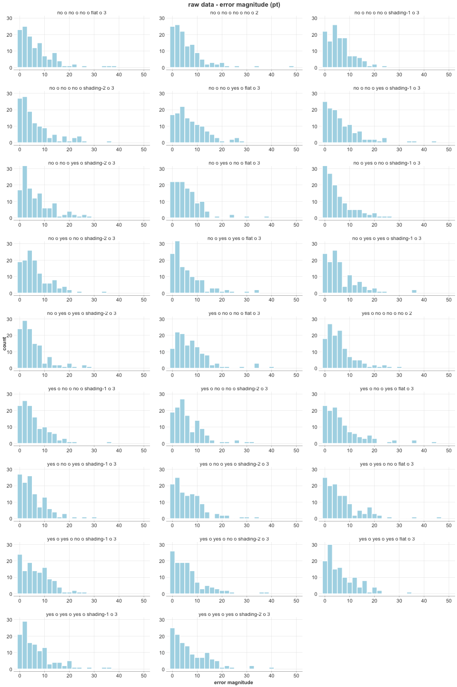

``` r
g_raw_time <- vtrials %>%
         ggplot(mapping = aes(x = ResponseTime)) +
         facet_wrap(AllFactors ~ .,ncol = 3, scales = "free") +
         coord_cartesian(xlim = c(0, 62), ylim = c(0, 30)) + 
         geom_histogram(binwidth = 2, fill = "lightgray", color = "white") +
         ggtitle("raw data - response time  (s)") + 
         xlab ("response time ") + ylab("count")

ggsave(g_raw_time, filename = "pic/g_raw_time.pdf", width = 10, height = 10, units = "in")

g_raw_time
```

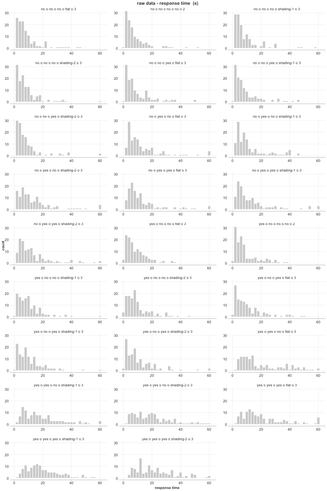 \# Models

Helper function
---------------

First we define a helper function to wrap up model diagnostics.

``` r
model_diagnostics <- function(m, name = "model diagnostics"){
  print(name)
  
  print(summary(m))

  # plot(m) # run this line to check convergence when first fitting the model
  
  plot(pp_check(m, type = "dens_overlay", nsamples = 100))
  plot(pp_check(m, type = "stat_2d", nsamples = 2000))
  plot(pp_check(m, type = "error_binned", nsamples = 100))
  
  print(loo(m))
  print(waic(m))
}
```

Model specification
-------------------

For **error magnitude**, we have 0. Therefore, we use a hurdle_gamma
distribution to account for this. Based on the experimental design,
*Dimensionality* only interacts with Device and DataModel. The other
five variables could interact with each other. We are also concerned
about the difference between *Dimensionality*; we therefore model it as
a group-level effect. The two data models have different ranges of
accuracy; we also specify it as a group-effect. Last, each trial has
different true accuracies, and we specify it as another random intercept
to separate the effects. Because of the skewness (we also don’t have
evidence of error magnitude being normally distributed), we use a gamma
likelihood instead of normal/student_t. Because of the zero values (no
error), we use a hurdle gamma likelihood. Other choices like skewed
normal are also reasonable, but gamma results in posterior prediction
best capturing the data and of a smaller waic. Since we care about mean
of error magnitude and the data also does not suggest a big variance in
standard deviation across conditions, we did not use a submodel for
standard deviation.

``` r
if(REBUILD_FLAG){

  m_error_hurdle_gamma <- bf(ErrorMagnitude ~  
                           0 + Intercept + 
                           Device*Motion*Shading*Projection*DataModel +  
                           Device*Dimensionality*DataModel + 
                           (1 + Dimensionality*DataModel | ParticipantID) + 
                           (1 | TrialIntAccuracy), 
                           family = hurdle_gamma(link = "log")
                        ) 
  
  get_prior(m_error_hurdle_gamma, data = trials)

    
  m_brms_error_hurdle_gamma <<- brm(m_error_hurdle_gamma, 
                               data = trials, 
                               family = hurdle_gamma(link = "log"), 
                               prior = c( # priors" 2 SDs roughly catch 95% data
                                  prior(normal(0, 2.5), class = "b"),
                                  prior(normal(0, 25),  class = "b", coef = "Intercept"), 
                                  prior(gamma(1, 10), class = "shape"),
                                  prior(student_t(3, 0, 5), class = "sd")
                                ), 
                                chains = N_CHAINS, iter = N_ITER, warmup = N_WARMUP, thin = N_THIN, cores = N_CORES,
                                control = list(adapt_delta = DELTA, max_treedepth = TREE_DEPTH))
  
  saveRDS(file = "rds/m_brms_error_hurdle_gamma.rds", m_brms_error_hurdle_gamma)
  
}else{
  m_brms_error_hurdle_gamma <<- readRDS("rds/m_brms_error_hurdle_gamma.rds")
}

model_diagnostics(m_brms_error_hurdle_gamma)
```

    ## [1] "model diagnostics"
    ##  Family: hurdle_gamma 
    ##   Links: mu = log; shape = identity; hu = identity 
    ## Formula: ErrorMagnitude ~ 0 + Intercept + Device * Motion * Shading * Projection * DataModel + Device * Dimensionality * DataModel + (1 + Dimensionality * DataModel | ParticipantID) + (1 | TrialIntAccuracy) 
    ##    Data: trials (Number of observations: 3320) 
    ## Samples: 2 chains, each with iter = 4000; warmup = 2000; thin = 1;
    ##          total post-warmup samples = 4000
    ## 
    ## Group-Level Effects: 
    ## ~ParticipantID (Number of levels: 32) 
    ##                                              Estimate Est.Error l-95% CI u-95% CI Rhat Bulk_ESS Tail_ESS
    ## sd(Intercept)                                    0.21      0.04     0.14     0.29 1.00     1870     2645
    ## sd(Dimensionality)                               0.14      0.08     0.01     0.31 1.00      618     1439
    ## sd(DataModel)                                    0.39      0.07     0.26     0.54 1.00     2063     2479
    ## sd(Dimensionality:DataModel)                     0.20      0.14     0.01     0.52 1.00      976     1716
    ## cor(Intercept,Dimensionality)                    0.16      0.37    -0.56     0.82 1.00     3300     2996
    ## cor(Intercept,DataModel)                        -0.18      0.23    -0.59     0.28 1.00     1052     2217
    ## cor(Dimensionality,DataModel)                   -0.30      0.36    -0.87     0.49 1.00      344      822
    ## cor(Intercept,Dimensionality:DataModel)         -0.08      0.40    -0.79     0.70 1.00     5273     2422
    ## cor(Dimensionality,Dimensionality:DataModel)    -0.11      0.44    -0.86     0.75 1.00     2341     3379
    ## cor(DataModel,Dimensionality:DataModel)          0.09      0.41    -0.68     0.81 1.00     3940     2975
    ## 
    ## ~TrialIntAccuracy (Number of levels: 45) 
    ##               Estimate Est.Error l-95% CI u-95% CI Rhat Bulk_ESS Tail_ESS
    ## sd(Intercept)     0.31      0.04     0.24     0.40 1.00     1166     1885
    ## 
    ## Population-Level Effects: 
    ##                                            Estimate Est.Error l-95% CI u-95% CI Rhat Bulk_ESS Tail_ESS
    ## Intercept                                      2.02      0.07     1.89     2.16 1.00     1053     1750
    ## Device                                        -0.01      0.07    -0.14     0.12 1.00     3327     3076
    ## Motion                                        -0.14      0.04    -0.21    -0.07 1.00     5475     3180
    ## Shading                                       -0.03      0.03    -0.10     0.03 1.00     7804     2770
    ## Projection                                    -0.01      0.03    -0.06     0.05 1.00     9209     2851
    ## DataModel                                      0.06      0.10    -0.13     0.26 1.00     2483     2642
    ## Dimensionality                                 0.10      0.07    -0.04     0.24 1.00     3495     3247
    ## Device:Motion                                  0.01      0.07    -0.14     0.15 1.00     6132     3311
    ## Device:Shading                                -0.02      0.07    -0.16     0.12 1.00     7499     2505
    ## Motion:Shading                                 0.08      0.07    -0.05     0.22 1.00     6938     2722
    ## Device:Projection                             -0.03      0.06    -0.15     0.08 1.00     7451     2748
    ## Motion:Projection                             -0.04      0.06    -0.15     0.07 1.00     6328     2755
    ## Shading:Projection                             0.05      0.07    -0.08     0.19 1.00     8523     2898
    ## Device:DataModel                               0.12      0.13    -0.14     0.38 1.00     3001     3260
    ## Motion:DataModel                              -0.09      0.08    -0.24     0.06 1.00     5400     3008
    ## Shading:DataModel                             -0.05      0.07    -0.18     0.09 1.00     7826     3058
    ## Projection:DataModel                           0.08      0.06    -0.03     0.19 1.00     8283     2846
    ## Device:Dimensionality                          0.13      0.13    -0.13     0.39 1.00     3238     2883
    ## DataModel:Dimensionality                       0.13      0.15    -0.16     0.41 1.00     3755     2879
    ## Device:Motion:Shading                          0.07      0.14    -0.20     0.34 1.00     6752     2737
    ## Device:Motion:Projection                       0.08      0.11    -0.14     0.29 1.00     6874     3048
    ## Device:Shading:Projection                      0.22      0.14    -0.05     0.49 1.00     6903     2914
    ## Motion:Shading:Projection                      0.04      0.14    -0.23     0.31 1.00     7891     2759
    ## Device:Motion:DataModel                        0.06      0.15    -0.24     0.37 1.00     4904     3206
    ## Device:Shading:DataModel                       0.03      0.14    -0.23     0.29 1.00     8051     2851
    ## Motion:Shading:DataModel                       0.40      0.14     0.12     0.68 1.00     8057     2993
    ## Device:Projection:DataModel                    0.15      0.11    -0.08     0.37 1.00     7968     2544
    ## Motion:Projection:DataModel                   -0.01      0.11    -0.23     0.22 1.00     9284     3260
    ## Shading:Projection:DataModel                  -0.12      0.14    -0.38     0.15 1.00     7534     3180
    ## Device:DataModel:Dimensionality               -0.13      0.27    -0.64     0.39 1.00     2963     3109
    ## Device:Motion:Shading:Projection              -0.00      0.28    -0.56     0.54 1.00     7841     2668
    ## Device:Motion:Shading:DataModel                0.23      0.27    -0.29     0.75 1.00     7980     2814
    ## Device:Motion:Projection:DataModel            -0.20      0.22    -0.65     0.24 1.00     7392     2982
    ## Device:Shading:Projection:DataModel           -0.01      0.27    -0.54     0.52 1.00     7343     3027
    ## Motion:Shading:Projection:DataModel            0.45      0.27    -0.08     0.98 1.00     7634     2675
    ## Device:Motion:Shading:Projection:DataModel    -0.11      0.54    -1.17     0.95 1.00     7352     2956
    ## 
    ## Family Specific Parameters: 
    ##       Estimate Est.Error l-95% CI u-95% CI Rhat Bulk_ESS Tail_ESS
    ## shape     1.80      0.04     1.72     1.89 1.00     6263     2724
    ## hu        0.07      0.00     0.06     0.08 1.00     8891     2888
    ## 
    ## Samples were drawn using sampling(NUTS). For each parameter, Bulk_ESS
    ## and Tail_ESS are effective sample size measures, and Rhat is the potential
    ## scale reduction factor on split chains (at convergence, Rhat = 1).

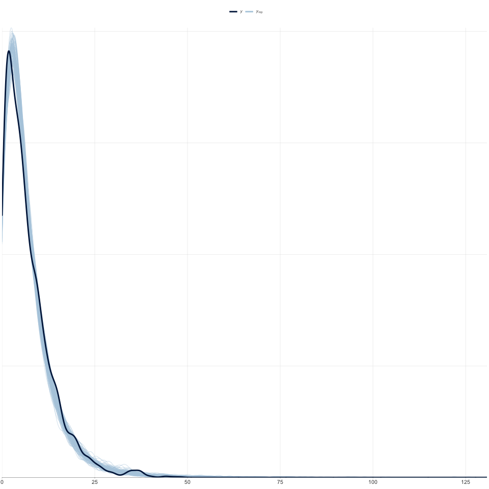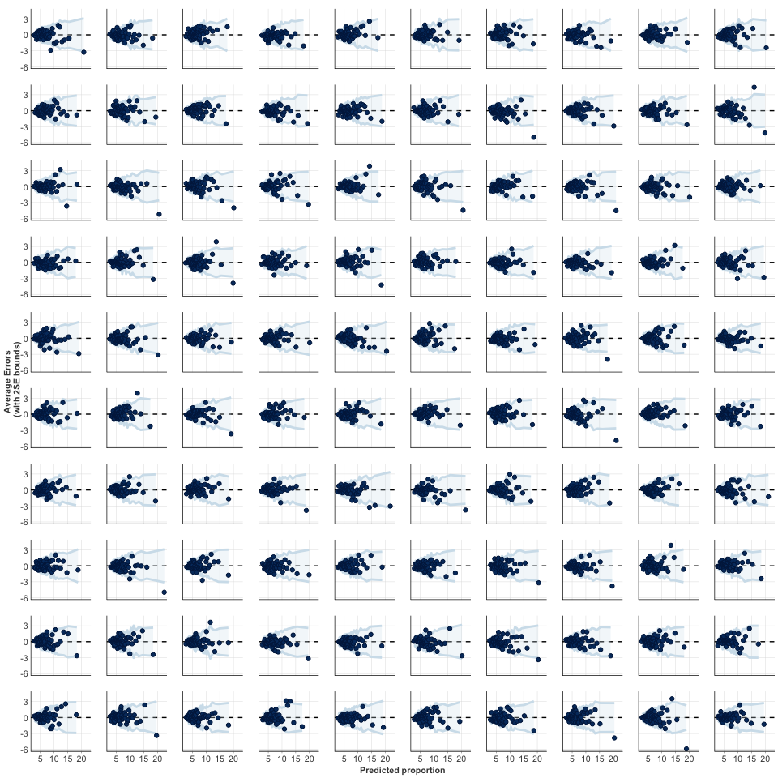

    ## 
    ## Computed from 4000 by 3320 log-likelihood matrix
    ## 
    ## ------
    ## Monte Carlo SE of elpd_loo is NA.
    ## 
    ## Pareto k diagnostic values:
    ##                          Count Pct.    Min. n_eff
    ## (-Inf, 0.5]   (good)     3308  99.6%   774       
    ##  (0.5, 0.7]   (ok)         11   0.3%   471       
    ##    (0.7, 1]   (bad)         1   0.0%   219       
    ##    (1, Inf)   (very bad)    0   0.0%   <NA>      
    ## See help('pareto-k-diagnostic') for details.
    ## 
    ## Computed from 4000 by 3320 log-likelihood matrix
    ## 
    ## 
    ## 32 (1.0%) p_waic estimates greater than 0.4. We recommend trying loo instead.

For **response time**, we have a similar motivation with error magnitude
with a few exceptions. First response time is positive. Therefore a
gamma distribution is good enough. Second, we know the upper bound of
response time is about 60 is cropped. We need to tell the model about
this (left censored). Also, data model and dimensionality probably does
not affect response time very much; however, different devices and
motion levels should be treated differently. So we use Device\*Motion as
the group-level effects to replace data properties as group-level
effects. We note that the distributions of response time could look very
different; a sub-model for shape is more appropriate to capture the
difference. We added Device and Motion as fixed effects (adding random
effects would let the model not converge.)

``` r
if(REBUILD_FLAG == TRUE){
  
  trials <- trials %>%
      mutate(cen = ifelse(ResponseTime > 60, "left", "none"))

  m_time_gamma <- bf(
                    ResponseTime | cens(cen) ~ 0 + Intercept +
                      Device*Motion*Shading*Projection*DataModel +  
                      Device*Dimensionality*DataModel + 
                      (1 + Device*Motion | ParticipantID),
                    shape ~ 0 + Intercept + 
                      Device*Motion,
                      family = Gamma(link="log")
                     ) 
    
  priors_time_gamma <- c(
                prior(normal(0, 2.5), class = "b"),
                prior(normal(0, 30), class = "b", coef = "Intercept"), 
                #prior(gamma(1, 20), class = "shape"),
                prior(student_t(3, 0, 10), class = "sd")
                ) 
    
  m_brms_time_gamma <<- brm(m_time_gamma, 
                              data = trials, family = Gamma(link="log"),  prior = priors_time_gamma, 
                              chains = N_CHAINS, iter = N_ITER, warmup = N_WARMUP, thin = N_THIN, cores = N_CORES,
                              control = list(adapt_delta = DELTA, max_treedepth = TREE_DEPTH))
  
  saveRDS(file = "rds/m_brms_time_gamma.rds", m_brms_time_gamma)
  
}else{
  
  m_brms_time_gamma <<- readRDS("rds/m_brms_time_gamma.rds")
}

model_diagnostics(m_brms_time_gamma)
```

    ## [1] "model diagnostics"
    ##  Family: gamma 
    ##   Links: mu = log; shape = log 
    ## Formula: ResponseTime | cens(cen) ~ 0 + Intercept + Device * Motion * Shading * Projection * DataModel + Device * Dimensionality * DataModel + (1 + Device * Motion | ParticipantID) 
    ##          shape ~ 0 + Intercept + Device * Motion
    ##    Data: trials (Number of observations: 3320) 
    ## Samples: 2 chains, each with iter = 4000; warmup = 2000; thin = 1;
    ##          total post-warmup samples = 4000
    ## 
    ## Group-Level Effects: 
    ## ~ParticipantID (Number of levels: 32) 
    ##                              Estimate Est.Error l-95% CI u-95% CI Rhat Bulk_ESS Tail_ESS
    ## sd(Intercept)                    0.64      0.09     0.50     0.83 1.00      619     1047
    ## sd(Device)                       0.25      0.04     0.18     0.34 1.00     1487     2410
    ## sd(Motion)                       0.28      0.05     0.21     0.39 1.00     1240     2155
    ## sd(Device:Motion)                0.75      0.11     0.57     1.00 1.00     1352     2117
    ## cor(Intercept,Device)           -0.11      0.19    -0.47     0.27 1.00     1666     2117
    ## cor(Intercept,Motion)           -0.48      0.15    -0.73    -0.14 1.00     1510     2238
    ## cor(Device,Motion)              -0.10      0.20    -0.47     0.29 1.00     1374     2118
    ## cor(Intercept,Device:Motion)    -0.14      0.17    -0.46     0.21 1.00     1516     1932
    ## cor(Device,Device:Motion)        0.07      0.20    -0.32     0.46 1.00      881     1284
    ## cor(Motion,Device:Motion)        0.08      0.19    -0.29     0.45 1.00     1060     1998
    ## 
    ## Population-Level Effects: 
    ##                                            Estimate Est.Error l-95% CI u-95% CI Rhat Bulk_ESS Tail_ESS
    ## Intercept                                      2.26      0.12     2.02     2.51 1.00      325      446
    ## Device                                         0.37      0.07     0.24     0.50 1.00     1377     2148
    ## Motion                                         0.59      0.06     0.48     0.70 1.00      726     1221
    ## Shading                                        0.01      0.02    -0.04     0.05 1.00     4377     3009
    ## Projection                                     0.04      0.02     0.00     0.08 1.00     5214     3050
    ## DataModel                                      0.14      0.07     0.00     0.28 1.00     1779     2192
    ## Dimensionality                                 0.12      0.05     0.02     0.21 1.00     3480     2749
    ## Device:Motion                                  0.37      0.14     0.10     0.64 1.00     1028     1576
    ## Device:Shading                                 0.09      0.05    -0.00     0.18 1.00     4318     3257
    ## Motion:Shading                                 0.14      0.05     0.05     0.24 1.00     4505     3233
    ## Device:Projection                              0.03      0.04    -0.04     0.11 1.00     3927     3083
    ## Motion:Projection                              0.05      0.04    -0.03     0.12 1.00     4671     2727
    ## Shading:Projection                            -0.07      0.05    -0.16     0.02 1.00     4987     3140
    ## Device:DataModel                               0.03      0.14    -0.25     0.30 1.00     1686     2286
    ## Motion:DataModel                              -0.03      0.13    -0.28     0.21 1.00     1034     1907
    ## Shading:DataModel                              0.08      0.05    -0.02     0.17 1.00     4493     3197
    ## Projection:DataModel                           0.02      0.04    -0.06     0.09 1.00     5456     3255
    ## Device:Dimensionality                         -0.06      0.10    -0.25     0.14 1.00     2389     2497
    ## DataModel:Dimensionality                       0.05      0.10    -0.13     0.24 1.00     3214     3124
    ## Device:Motion:Shading                         -0.06      0.10    -0.25     0.13 1.00     4254     3154
    ## Device:Motion:Projection                      -0.05      0.08    -0.21     0.10 1.00     4534     2951
    ## Device:Shading:Projection                      0.07      0.10    -0.12     0.26 1.00     4206     3077
    ## Motion:Shading:Projection                      0.10      0.09    -0.08     0.28 1.00     4418     2764
    ## Device:Motion:DataModel                        0.41      0.27    -0.11     0.94 1.00     1089     1832
    ## Device:Shading:DataModel                      -0.02      0.09    -0.20     0.16 1.00     4394     3027
    ## Motion:Shading:DataModel                       0.05      0.09    -0.14     0.23 1.00     4495     3062
    ## Device:Projection:DataModel                   -0.03      0.08    -0.19     0.13 1.00     4629     3153
    ## Motion:Projection:DataModel                   -0.06      0.08    -0.21     0.10 1.00     4786     3071
    ## Shading:Projection:DataModel                   0.01      0.09    -0.17     0.19 1.00     4433     2713
    ## Device:DataModel:Dimensionality               -0.06      0.19    -0.45     0.31 1.00     3069     3234
    ## Device:Motion:Shading:Projection               0.23      0.19    -0.12     0.61 1.00     4461     2791
    ## Device:Motion:Shading:DataModel               -0.12      0.19    -0.50     0.25 1.00     4744     2852
    ## Device:Motion:Projection:DataModel             0.08      0.16    -0.23     0.38 1.00     4392     3094
    ## Device:Shading:Projection:DataModel           -0.05      0.19    -0.42     0.32 1.00     4654     3268
    ## Motion:Shading:Projection:DataModel            0.26      0.19    -0.11     0.62 1.00     4765     3103
    ## Device:Motion:Shading:Projection:DataModel     0.21      0.36    -0.48     0.90 1.00     4653     3151
    ## shape_Intercept                                1.30      0.02     1.26     1.35 1.00     4839     2742
    ## shape_Device                                   0.22      0.05     0.12     0.32 1.00     4953     2815
    ## shape_Motion                                   0.32      0.05     0.22     0.41 1.00     4527     2909
    ## shape_Device:Motion                            0.20      0.10     0.01     0.39 1.00     5633     2980
    ## 
    ## Samples were drawn using sampling(NUTS). For each parameter, Bulk_ESS
    ## and Tail_ESS are effective sample size measures, and Rhat is the potential
    ## scale reduction factor on split chains (at convergence, Rhat = 1).

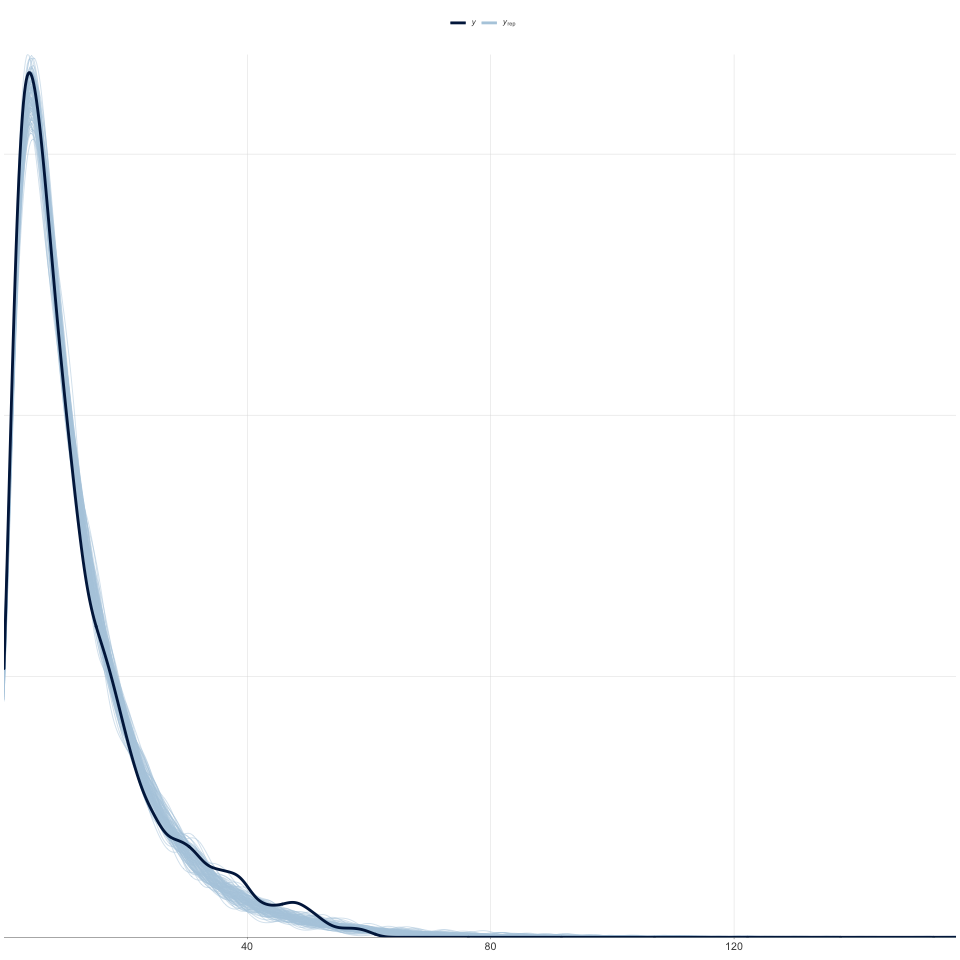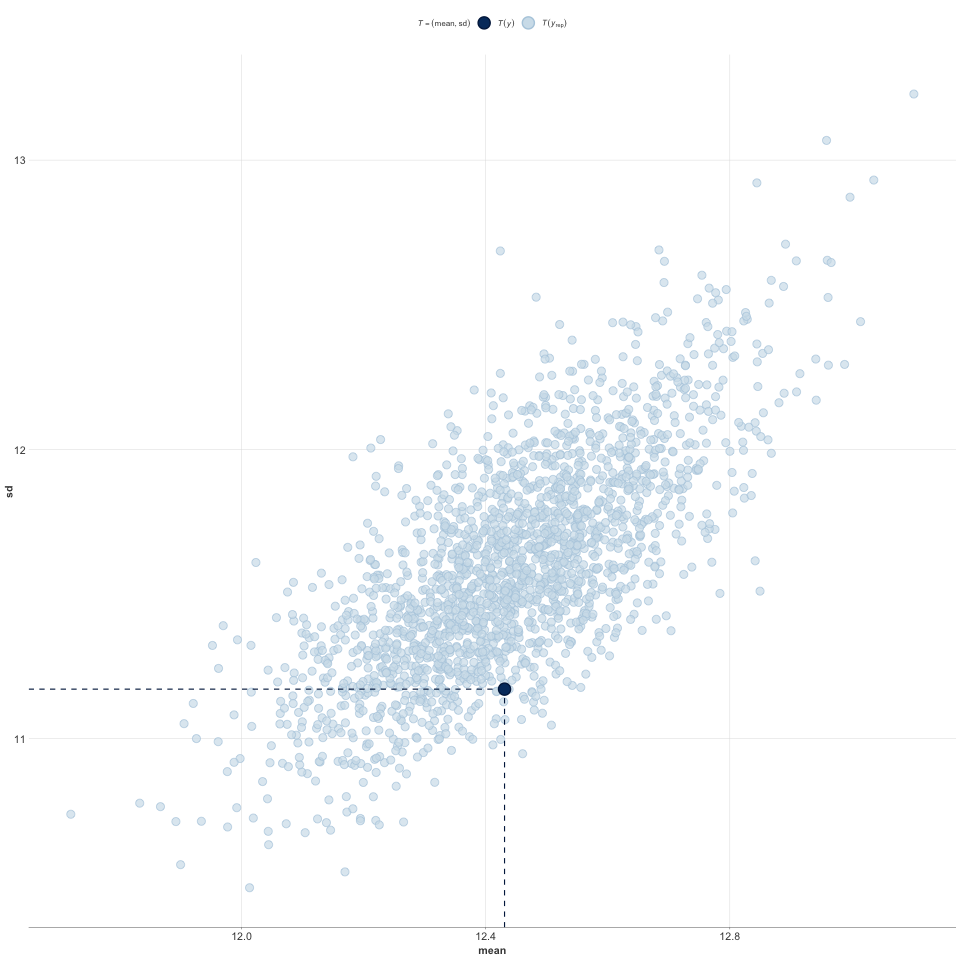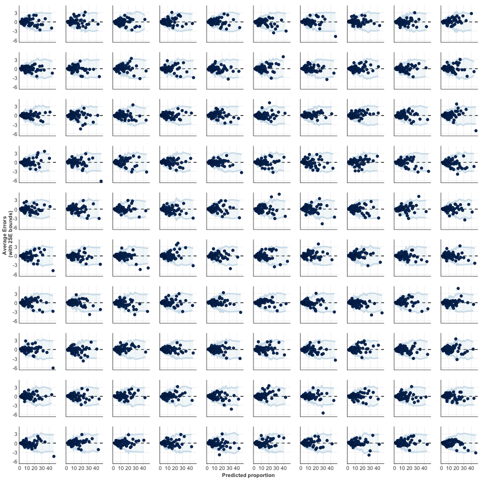

    ## 
    ## Computed from 4000 by 3320 log-likelihood matrix
    ## 
    ## ------
    ## Monte Carlo SE of elpd_loo is NA.
    ## 
    ## Pareto k diagnostic values:
    ##                          Count Pct.    Min. n_eff
    ## (-Inf, 0.5]   (good)     3304  99.5%   403       
    ##  (0.5, 0.7]   (ok)         10   0.3%   111       
    ##    (0.7, 1]   (bad)         6   0.2%   23        
    ##    (1, Inf)   (very bad)    0   0.0%   <NA>      
    ## See help('pareto-k-diagnostic') for details.
    ## 
    ## Computed from 4000 by 3320 log-likelihood matrix
    ## 
    ## 
    ## 67 (2.0%) p_waic estimates greater than 0.4. We recommend trying loo instead.

``` r
summary(m_brms_time_gamma)
```

    ##  Family: gamma 
    ##   Links: mu = log; shape = log 
    ## Formula: ResponseTime | cens(cen) ~ 0 + Intercept + Device * Motion * Shading * Projection * DataModel + Device * Dimensionality * DataModel + (1 + Device * Motion | ParticipantID) 
    ##          shape ~ 0 + Intercept + Device * Motion
    ##    Data: trials (Number of observations: 3320) 
    ## Samples: 2 chains, each with iter = 4000; warmup = 2000; thin = 1;
    ##          total post-warmup samples = 4000
    ## 
    ## Group-Level Effects: 
    ## ~ParticipantID (Number of levels: 32) 
    ##                              Estimate Est.Error l-95% CI u-95% CI Rhat Bulk_ESS Tail_ESS
    ## sd(Intercept)                    0.64      0.09     0.50     0.83 1.00      619     1047
    ## sd(Device)                       0.25      0.04     0.18     0.34 1.00     1487     2410
    ## sd(Motion)                       0.28      0.05     0.21     0.39 1.00     1240     2155
    ## sd(Device:Motion)                0.75      0.11     0.57     1.00 1.00     1352     2117
    ## cor(Intercept,Device)           -0.11      0.19    -0.47     0.27 1.00     1666     2117
    ## cor(Intercept,Motion)           -0.48      0.15    -0.73    -0.14 1.00     1510     2238
    ## cor(Device,Motion)              -0.10      0.20    -0.47     0.29 1.00     1374     2118
    ## cor(Intercept,Device:Motion)    -0.14      0.17    -0.46     0.21 1.00     1516     1932
    ## cor(Device,Device:Motion)        0.07      0.20    -0.32     0.46 1.00      881     1284
    ## cor(Motion,Device:Motion)        0.08      0.19    -0.29     0.45 1.00     1060     1998
    ## 
    ## Population-Level Effects: 
    ##                                            Estimate Est.Error l-95% CI u-95% CI Rhat Bulk_ESS Tail_ESS
    ## Intercept                                      2.26      0.12     2.02     2.51 1.00      325      446
    ## Device                                         0.37      0.07     0.24     0.50 1.00     1377     2148
    ## Motion                                         0.59      0.06     0.48     0.70 1.00      726     1221
    ## Shading                                        0.01      0.02    -0.04     0.05 1.00     4377     3009
    ## Projection                                     0.04      0.02     0.00     0.08 1.00     5214     3050
    ## DataModel                                      0.14      0.07     0.00     0.28 1.00     1779     2192
    ## Dimensionality                                 0.12      0.05     0.02     0.21 1.00     3480     2749
    ## Device:Motion                                  0.37      0.14     0.10     0.64 1.00     1028     1576
    ## Device:Shading                                 0.09      0.05    -0.00     0.18 1.00     4318     3257
    ## Motion:Shading                                 0.14      0.05     0.05     0.24 1.00     4505     3233
    ## Device:Projection                              0.03      0.04    -0.04     0.11 1.00     3927     3083
    ## Motion:Projection                              0.05      0.04    -0.03     0.12 1.00     4671     2727
    ## Shading:Projection                            -0.07      0.05    -0.16     0.02 1.00     4987     3140
    ## Device:DataModel                               0.03      0.14    -0.25     0.30 1.00     1686     2286
    ## Motion:DataModel                              -0.03      0.13    -0.28     0.21 1.00     1034     1907
    ## Shading:DataModel                              0.08      0.05    -0.02     0.17 1.00     4493     3197
    ## Projection:DataModel                           0.02      0.04    -0.06     0.09 1.00     5456     3255
    ## Device:Dimensionality                         -0.06      0.10    -0.25     0.14 1.00     2389     2497
    ## DataModel:Dimensionality                       0.05      0.10    -0.13     0.24 1.00     3214     3124
    ## Device:Motion:Shading                         -0.06      0.10    -0.25     0.13 1.00     4254     3154
    ## Device:Motion:Projection                      -0.05      0.08    -0.21     0.10 1.00     4534     2951
    ## Device:Shading:Projection                      0.07      0.10    -0.12     0.26 1.00     4206     3077
    ## Motion:Shading:Projection                      0.10      0.09    -0.08     0.28 1.00     4418     2764
    ## Device:Motion:DataModel                        0.41      0.27    -0.11     0.94 1.00     1089     1832
    ## Device:Shading:DataModel                      -0.02      0.09    -0.20     0.16 1.00     4394     3027
    ## Motion:Shading:DataModel                       0.05      0.09    -0.14     0.23 1.00     4495     3062
    ## Device:Projection:DataModel                   -0.03      0.08    -0.19     0.13 1.00     4629     3153
    ## Motion:Projection:DataModel                   -0.06      0.08    -0.21     0.10 1.00     4786     3071
    ## Shading:Projection:DataModel                   0.01      0.09    -0.17     0.19 1.00     4433     2713
    ## Device:DataModel:Dimensionality               -0.06      0.19    -0.45     0.31 1.00     3069     3234
    ## Device:Motion:Shading:Projection               0.23      0.19    -0.12     0.61 1.00     4461     2791
    ## Device:Motion:Shading:DataModel               -0.12      0.19    -0.50     0.25 1.00     4744     2852
    ## Device:Motion:Projection:DataModel             0.08      0.16    -0.23     0.38 1.00     4392     3094
    ## Device:Shading:Projection:DataModel           -0.05      0.19    -0.42     0.32 1.00     4654     3268
    ## Motion:Shading:Projection:DataModel            0.26      0.19    -0.11     0.62 1.00     4765     3103
    ## Device:Motion:Shading:Projection:DataModel     0.21      0.36    -0.48     0.90 1.00     4653     3151
    ## shape_Intercept                                1.30      0.02     1.26     1.35 1.00     4839     2742
    ## shape_Device                                   0.22      0.05     0.12     0.32 1.00     4953     2815
    ## shape_Motion                                   0.32      0.05     0.22     0.41 1.00     4527     2909
    ## shape_Device:Motion                            0.20      0.10     0.01     0.39 1.00     5633     2980
    ## 
    ## Samples were drawn using sampling(NUTS). For each parameter, Bulk_ESS
    ## and Tail_ESS are effective sample size measures, and Rhat is the potential
    ## scale reduction factor on split chains (at convergence, Rhat = 1).

Now we have the models. Before we head towards guiding questions, we
first a helper function for plotting the results.

``` r
draw_coefs <- function(m, 
                       target_coefs, 
                       title = "", 
                       fill_color = "white" , 
                       breaks_x = seq(0, 1, by = 0.5)
                       ){
  post_samples <- posterior_samples(m, pars = "b_") 
  
  b_CIs <-  post_samples %>% 
            select(target_coefs) %>% 
            gather(key = "coefs", value = "value") %>% 
            group_by(coefs) %>%
            median_qi() %>%
            ungroup() %>%
            mutate(lower95 = exp(.lower), upper95 = exp(.upper), median = exp(value))%>%
            select(coefs, median, lower95, upper95) %>%
            mutate(coefs = factor(coefs, levels = rev(target_coefs)), 
                 s_lower95 = round(lower95, 3), s_upper95 = round(upper95, 3),
                 CIs = paste0(round(median, 3), ' [', s_lower95, ',',  s_upper95, ']'))
    
  b_samples <-  post_samples %>% 
    select(target_coefs) %>% 
    gather(key = "coefs", value = "value") %>% 
    ungroup() 
 
  g <- b_samples %>%
    mutate(value = exp(value)) %>%
    ggplot(aes(x = value, y = coefs)) + 
      geom_richtext(data = b_CIs, mapping = aes(x = tail(breaks_x, n = 1) * 1.1, y = coefs, label = CIs), 
                 size = 2, 
                 fill = NA, label.color = NA, # remove background and outline
                 label.padding = grid::unit(rep(0, 4), "pt")) + 
      geom_density_ridges(
                  fill = fill_color, color = fill_color, 
                  rel_min_height = 0.0001,
                  alpha = 0.5,
                  scale = .9,
                  size = 0.5
                  ) + 
      geom_vline(xintercept = 1, linetype = "dashed", size = LINE_SIZE) +
      scale_x_continuous(breaks = breaks_x, expand = expansion(mult = c(0.01, .5))) +
      coord_cartesian(xlim = c(breaks_x[1], tail(breaks_x, n = 1))) +
      ggtitle(title) + xlab("exp(beta)") + ylab("") 
  
  return(g)
}
```

Results
=======

GQ1: How do the six manipulated variables affect participants’ performance?
---------------------------------------------------------------------------

To answer the first guiding question, we look at the model coefficients
of each experimental variable from fixed effects. The coefficients from
fixed effects tell us the overall *weight* of each variable when
conditioning on just that variable for an average; note that the sign
and direction of an effect depends on coding.

``` r
target_coefs_rq1 <- c("b_Device", "b_Motion", "b_Projection", "b_Shading", "b_Dimensionality", "b_DataModel")


g1_rq1 <- draw_coefs(m_brms_error_hurdle_gamma, 
                 target_coefs_rq1, 
                 "Error magnitude", 
                 ERROR_COLOR, 
                 breaks_x = seq(0.75, 1.5, by = 0.25))
g2_rq1 <- draw_coefs(m_brms_time_gamma, 
                 target_coefs_rq1, 
                 "Response time",
                 TIME_COLOR, 
                 breaks_x = seq(0.85, 2.2, by = 0.45))

g_combined_rq1 <- ggarrange(g1_rq1, g2_rq1, ncol = 2)

ggsave(g_combined_rq1, filename = "pic/RQ1-mean-effects.pdf", width = 8, height = 2.25, units = "in")

g_combined_rq1
```

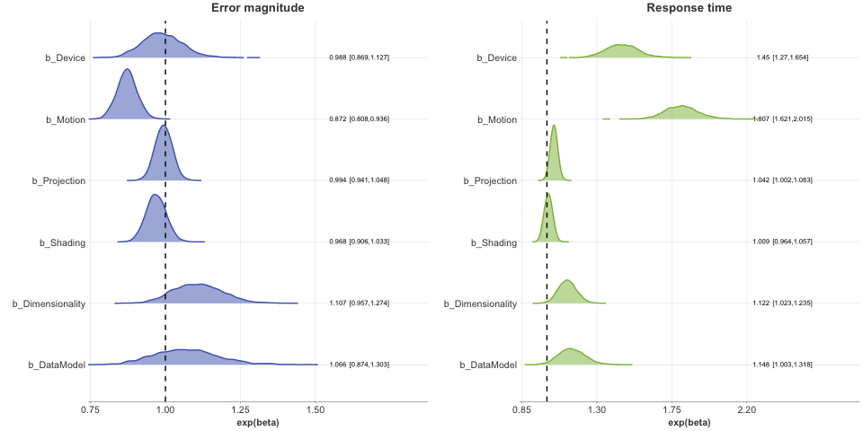

GQ2: How do the experimental variables interact with each other?
----------------------------------------------------------------

Similar to our investigation for the first guiding question, we use the
model coefficients to investigate the interactions effects between
variables. We only considered two-way interaction effects for
simplicity; more complicated interaction effects were implied by the
analyses below in GQ4.

``` r
target_coefs_rq2 <- c("b_Device:Motion", 
                  "b_Device:Shading", 
                  "b_Device:Projection",
                  "b_Device:Dimensionality", 
                  "b_Device:DataModel", 
                  "b_Motion:Shading", 
                  "b_Motion:Projection", 
                  "b_Motion:DataModel", 
                  "b_Shading:Projection", 
                  "b_Shading:DataModel", 
                  "b_Projection:DataModel", 
                  "b_DataModel:Dimensionality")


g1_rq2 <- draw_coefs(m_brms_error_hurdle_gamma, 
                 target_coefs_rq2, 
                 "Error magnitude", 
                 ERROR_COLOR, 
                 breaks_x = seq(0.5, 2.1, by = 0.5))
g2_rq2 <- draw_coefs(m_brms_time_gamma, 
                 target_coefs_rq2, 
                 "Response time",
                 TIME_COLOR, 
                 breaks_x = seq(0.5, 2.1, by = 0.5))

g_combined_rq2 <- ggarrange(g1_rq2, g2_rq2, ncol = 2)

ggsave(g_combined_rq2, filename = "pic/RQ2-interaction-effects.pdf", width = 8.5, height = 3.75, units = "in")

g_combined_rq2
```

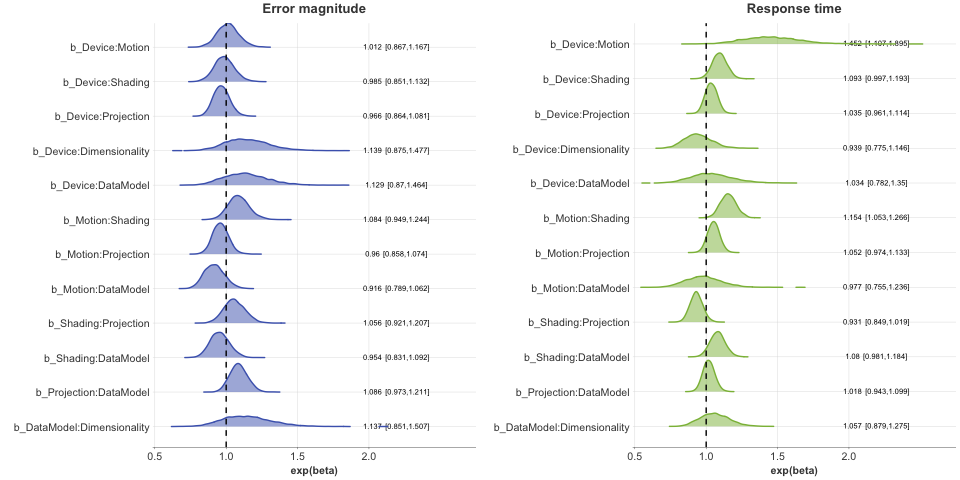

GQ3: How does each manipulation affect participants’ performance?
-----------------------------------------------------------------

To compare different levels of manipulations, we draw posterior samples
from the model to get an estimate of mean for each measure. These
posterior distributions show how an average participant does when
conditioning on that level of manipulation.

``` r
target_order <- c("Device", "Motion", "Projection", "Shading", "Dimensionality", "DataModel")
m <- m_brms_error_hurdle_gamma
 draw_post <- function( m, 
                        title = "", 
                        fill_color = "white" , 
                        palette_in, 
                        adjust_in,
                        breaks_x = seq(0, 1, by = 0.5)
                        ){
   
  post_samples <- trials %>%
        # these use theoritical centers, not practical centers...
        # data_grid(Device = c(-0.5, 0.5), Motion = 0, Projection = 0, Shading = 0, Dimensionality = 0, DataModel = 0) %>%
        # add_row(trials %>%data_grid(Device = 0, Motion = c(-0.5, 0.5), Projection = 0, Shading = 0, Dimensionality = 0, DataModel = 0))  %>%
        # add_row(trials %>%data_grid(Device = 0, Motion = 0, Projection = c(-0.5, 0.5), Shading = 0, Dimensionality = 0, DataModel = 0))  %>%
        # add_row(trials %>%data_grid(Device = 0, Motion = 0, Projection = 0, Shading = c(-0.5, 0, 0.5), Dimensionality = 0, DataModel = 0))  %>%
        # add_row(trials %>%data_grid(Device = 0, Motion = 0, Projection = 0, Shading = 0, Dimensionality = c(-0.5, 0.5), DataModel = 0))  %>%
        # add_row(trials %>%data_grid(Device = 0, Motion = 0, Projection = 0, Shading = 0, Dimensionality = 0, DataModel = c(-0.5, 0.5)))  %>%
    select(Device, Motion, Projection, Shading, Dimensionality, DataModel) %>%
    distinct() %>%
        #View(post_samples)
    add_fitted_draws(m, value = "sample_value", scale = "response", re_formula = NA, allow_new_levels = F) %>%
     select(-c(".chain", ".iteration"))%>%
     ungroup()%>%
     select(Device, Motion, Projection, Shading, Dimensionality, DataModel, sample_value) %>%
     gather(key = "levels_names", value = "levels_values", Device, Motion, Projection, Shading, Dimensionality, DataModel)  %>%
     mutate(levels_names = factor(levels_names, levels = rev(target_order)), levels_values = factor(levels_values))

  b_CIs <-  post_samples %>%
            group_by(levels_names, levels_values) %>%
            median_qi()  %>%
            ungroup() %>%
            mutate(lower95 = .lower, upper95 = .upper, median = sample_value)%>%
            mutate(levels_values = factor(levels_values),
                 s_lower95 = round(lower95, 3), s_upper95 = round(upper95, 3),
                 CIs = paste0(round(median, 3), ' [', s_lower95, ',',  s_upper95, ']'))

  g <- post_samples %>%
      ggplot(aes(x = sample_value, y = levels_names)) +
      geom_density_ridges(
                aes(fill = NA, color = levels_values),
                rel_min_height = 0.0005,
                alpha = 0.5,
                scale = .8,
                size = 0.4
                ) +
      geom_richtext(data = b_CIs, mapping = aes(x = tail(breaks_x, n = 1) * 1.2,
                                                y = levels_names,
                                                color = levels_values,
                                                label = CIs),
                 label.color = NA,
                 size = 2,
                 fill = NA,
                 label.padding = grid::unit(rep(0, 4), "pt")) +
      #scale_x_continuous(breaks = breaks_x, expand = expansion(mult = c(0.01, .5))) +
      scale_fill_manual(values = palette_in) +
      scale_color_manual(values = palette_in) +
      #coord_cartesian(xlim = c(breaks_x[1], tail(breaks_x, n = 1))) +
      ggtitle(title) + xlab("") + ylab("")

   return(g)
 }

g1_rq3 <- draw_post(m_brms_error_hurdle_gamma, 
                 "Error magnitude (pt)", 
                 ERROR_COLOR, 
                 PALETTE_ERROR,
                 adjust_in = 1, 
                 breaks_x = seq(0, 10, by = 6))

g2_rq3 <- draw_post(m_brms_time_gamma, 
                 "Response time (s)",
                 TIME_COLOR, 
                 PALETTE_TIME,
                 adjust_in = 1, 
                 breaks_x = seq(0, 18, by = 12))

g_combined_rq3 <- ggarrange(g1_rq3, g2_rq3, ncol = 2)

ggsave(g_combined_rq3, filename = "pic/RQ3-div.pdf", width = 6, height = 3.4, units = "in")

g_combined_rq3
```

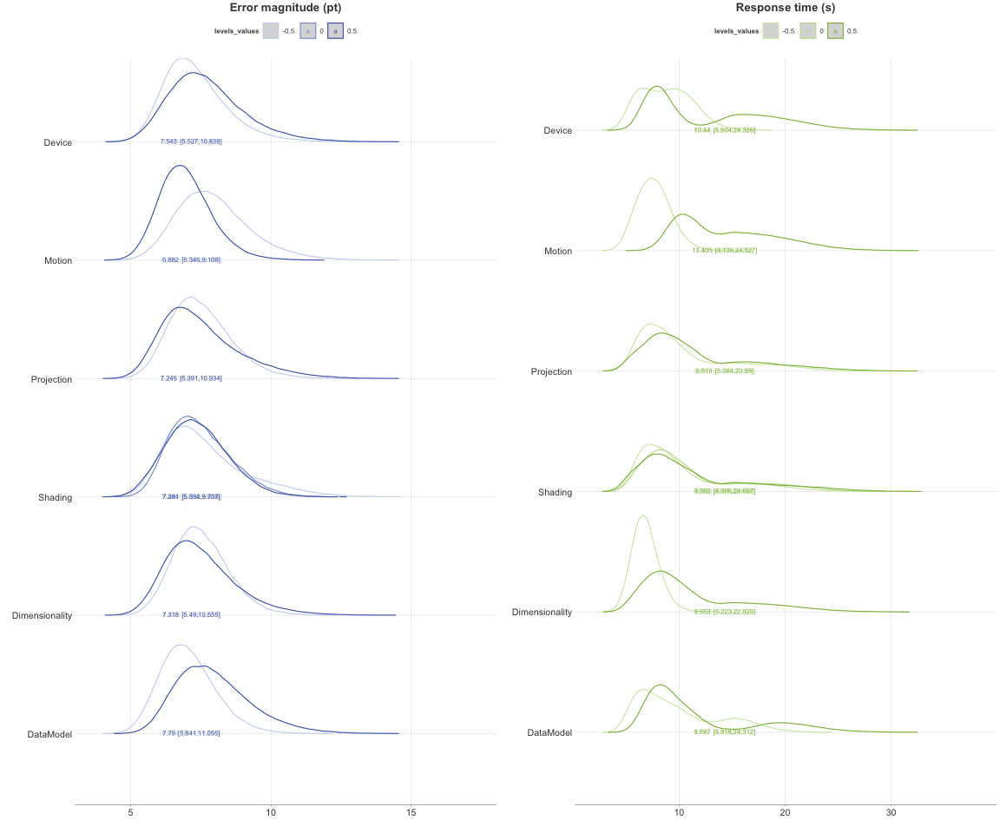

GQ4: Which resulting scatterplot designs are more effective for our task?
-------------------------------------------------------------------------

To investigate the effectiveness of each combination, we draw posterior
samples from the model to get an estimate of all possible combinations.
These posterior distributions show that how an average participant does
with one combination, which corresponds to an experimental condition.
Given our primary interest in error magnitude, we form a rank list of
performance based on median of mean distribution.

``` r
 global_order <- NULL

 draw_all <- function( m, 
                        title = "", 
                        fill_color = "white" , 
                        palette_in, 
                        adjust_in,
                        breaks_x = seq(0, 1, by = 0.5),
                        which = "error"
                        ){
  
  post_samples <- trials %>%
    select(Device, Motion, Projection, Shading, Dimensionality, DataModel) %>%
    distinct() %>%
    add_fitted_draws(m, value = "sample_value", scale = "response", re_formula = NA, allow_new_levels = FALSE) %>%
    select(-c(".chain", ".iteration"))%>%
    ungroup()%>%
    select(Device, Motion, Projection, Shading, Dimensionality, DataModel, sample_value) %>%
    mutate(  # code it back so that we know which one is which...
             Device = recode(Device,  `0.5` = "HMD", `-0.5` = "Desktop"),
             Motion = recode(Motion,  `0.5` = "Motion", `-0.5` = "No Motion"),
             Projection = recode(Projection, `0.5` = "Persp.", `-0.5` = "Orth."),
             Shading = recode(Shading, `0` = "Simple", `0.5` = "A.O.", `-0.5` = "Flat"),
             DataModel = recode(DataModel, `0.5` = "CIFAR", `-0.5` =  "bAbI"),
             Dimensionality = recode(Dimensionality, `-0.5` = "2D t-SNE",  `0.5` = "3D t-SNE"), 
             Condition = paste(Device, Motion, Projection, Shading, Dimensionality, DataModel, sep = seper))
  
  b_CIs <-  post_samples %>%
            select(Condition, sample_value) %>%
            group_by(Condition) %>%
            median_qi()  %>%
            ungroup() %>%
            mutate(lower95 = .lower, upper95 = .upper, median = sample_value, 
                   s_lower95 = round(lower95, 2), s_upper95 = round(upper95, 2),
                   CIs = paste0(round(median, 2), ' [', s_lower95, ',',  s_upper95, ']')) 
  if(which == "error"){
    b_CIs <- b_CIs %>%
            mutate(Condition = fct_reorder(Condition, .x = median, .desc = TRUE))
    global_order <<- levels(b_CIs$Condition)
  }else{
    b_CIs <- b_CIs %>%
            mutate(Condition = factor(Condition, levels = global_order))
  }
  
  
  median_max <- max(b_CIs$median)
  median_min <- min(b_CIs$median)
  
  g <- post_samples %>%
      ggplot(aes(x = sample_value, y = Condition)) +
      geom_vline(xintercept = median_max, linetype = "dashed", color = "black", size = LINE_SIZE) +
      geom_vline(xintercept = median_min, linetype = "dashed", color = "black", size = LINE_SIZE) +
      geom_richtext(data = b_CIs, mapping = aes(x = tail(breaks_x, n = 1) * 1.8, 
                                                y = Condition, 
                                                label = CIs), 
                 label.color = NA,
                 color = TEXT_COLOR,
                 size = 3, 
                 fill = NA, 
                 hjust = 1,
                 label.padding = grid::unit(rep(0, 4), "pt")) + 
      geom_density_ridges(
                  fill = fill_color,
                  color = fill_color,
                  rel_min_height = 0.00005,
                  alpha = 0.5,
                  scale = .9,
                  size = 0.5
                  ) +
      scale_x_continuous(breaks = breaks_x, expand = expansion(mult = c(0.01, .8))) +
      coord_cartesian(xlim = c(breaks_x[1], tail(breaks_x, n = 1))) +
      ggtitle(title) + xlab("") + ylab("") 
  g
  return(g)
}

g1_rq4 <- draw_all(m_brms_error_hurdle_gamma, 
                 "Error magnitude (pt)", 
                 ERROR_COLOR, 
                 PALETTE_ERROR,
                 adjust_in = 1, 
                 breaks_x = seq(0, 18, by = 6),
                 which = "error")

g2_rq4 <- draw_all(m_brms_time_gamma, 
                 "Response time (s)",
                 TIME_COLOR, 
                 PALETTE_TIME,
                 adjust_in = 1, 
                 breaks_x = seq(0, 36, by = 12),
                 which = "time")

g_combined_rq4 <- ggarrange(g1_rq4, g2_rq4, ncol = 2)

ggsave(g_combined_rq4, filename = "pic/RQ4-all.pdf", width = 14, height = 15, units = "in")
ggsave(g1_rq4, filename = "pic/RQ4-error.pdf", width = 8, height = 12.5, units = "in")
ggsave(g2_rq4, filename = "pic/RQ4-time.pdf", width = 8, height = 12.5, units = "in")

g_combined_rq4
```

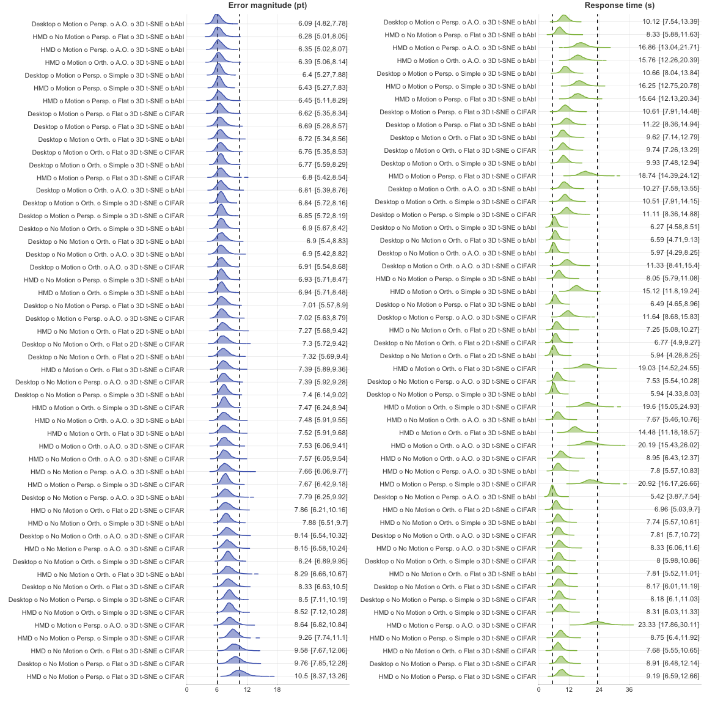

This is the encoding to design the bubbles maps.

``` r
 draw_tiles <- function( m, 
                        title = "", 
                        fill_color = "white" , 
                        stop_color = "white",
                        palette_in, 
                        adjust_in,
                        breaks_x = seq(0, 1, by = 0.5),
                        which = "error"
                        ){
  
  post_samples <- trials %>%
    select(Device, Motion, Projection, Shading, Dimensionality, DataModel) %>%
    distinct() %>%
    add_fitted_draws(m, value = "sample_value", scale = "response", re_formula = NA, allow_new_levels = FALSE) %>%
    select(-c(".chain", ".iteration"))%>%
    ungroup()%>%
    select(Device, Motion, Projection, Shading, Dimensionality, DataModel, sample_value) %>%
    mutate(  Device = recode(Device,  `0.5` = "2 HMD", `-0.5` = "1 Desktop"),
             Motion = recode(Motion,  `0.5` = "2 Motion", `-0.5` = "1 No Motion"),
             Projection = recode(Projection, `-0.5` = "1 Orthographic", `0.5` = "2 Perspective"),
             Shading = recode(Shading, `-0.5` = "1 Flat Shading", `0` = "2 Simple", `0.5` = "3 Ambient Occlusion"),
             DataModel = recode(DataModel, `0.5` = "2 CIFAR", `-0.5` =  "1 bAbI"),
             Dimensionality = recode(Dimensionality, `-0.5` = "2D t-SNE",  `0.5` = "3D t-SNE"), 
             Condition = paste(Dimensionality, Device, Motion, DataModel, Projection, Shading,  sep = seper))
  
  b_CIs <-  post_samples %>%
            select(Condition, sample_value) %>%
            group_by(Condition) %>%
            median_qi()  %>%
            ungroup() %>%
            mutate(lower95 = .lower, upper95 = .upper, median = sample_value, 
                   s_lower95 = round(lower95, 3), s_upper95 = round(upper95, 3),
                   CIs = paste0(round(median, 3), ' [', s_lower95, ',',  s_upper95, ']'),
                   index = row_number()
                   ) 
  scale_factor <- 2.8
  g <- b_CIs %>%
      ggplot() +
      theme(legend.position = "right", panel.grid.major = element_blank()) +
      coord_fixed(ratio = 1) +
      geom_tile(aes(x = 47, y = scale_factor * index), width = scale_factor, height = scale_factor, size = 0.1, fill = NA, color = "black") + 
      geom_circle(aes(color = median, x0 = 47, y0 = scale_factor * index, r = adjust_in * sqrt(upper95)), fill = NA, size = 0.1) +
      geom_circle(aes(fill = median, x0 = 47, y0 = scale_factor * index, r = adjust_in * sqrt(median)), color = NA,  size = 0.1) +
      geom_circle(aes(x0 = 47, y0 = scale_factor * index, r = adjust_in * sqrt(lower95)), color = "white", fill = NA, size = 0.1) +
      geom_text(aes(x = 20, y = scale_factor * index, label = Condition), size = 2) +
      scale_x_continuous(limits = c(0, 50)) +
      scale_fill_gradient(low = stop_color, high = fill_color, limits = c(breaks_x[1], tail(breaks_x, n = 1)), guide = "colourbar") +
      scale_color_gradient(low = stop_color, high = fill_color, limits = c(breaks_x[1], tail(breaks_x, n = 1)), guide = "colourbar") + 
      scale_y_reverse() + 
      ggtitle(title) + xlab("") + ylab("") 
  g
  return(g)
}

g1_rq4_tiles <- draw_tiles(m_brms_error_hurdle_gamma, 
                 "Error magnitude (pt)", 
                 ERROR_COLOR, 
                  "white",
                 PALETTE_ERROR,
                 adjust_in = 0.35, 
                 breaks_x = seq(3, 15, by = 4),
                 which = "error")

g2_rq4_tiles <- draw_tiles(m_brms_time_gamma, 
                 "Response time (s)",
                "#699923", #8bba45 
                "#f0fcd7", 
                 PALETTE_TIME,
                 adjust_in = 0.24, 
                 breaks_x = seq(0, 36, by = 12),
                 which = "time")

g_combined_rq4_tiles <- ggarrange(g1_rq4_tiles, g2_rq4_tiles, ncol = 2)

ggsave(g_combined_rq4_tiles, filename = "pic/RQ4-bubbles.pdf", width = 10.5, height = 19.5, units = "in")

g_combined_rq4_tiles
```

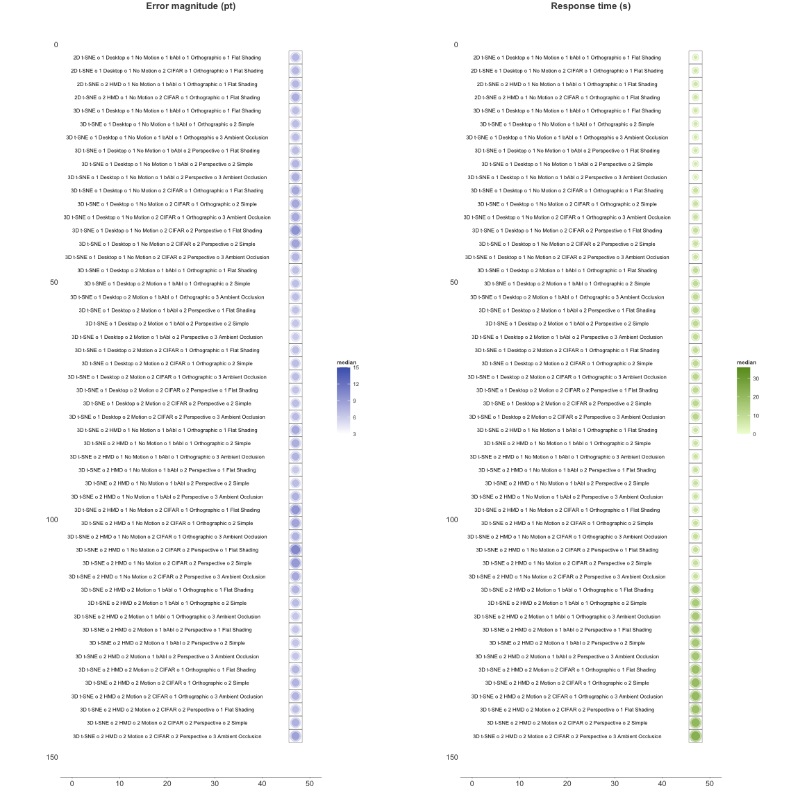

Misc figures
============

Demographics
------------

``` r
demographics <- metas %>% select(familiarML, familiarDR, familiarVIS, familiarVR)
demographics_stack <- stack(demographics)
demographics_stack$overall <- paste(demographics_stack$values, demographics_stack$ind, sep = " ")

demographics_table <- aggregate(data = demographics_stack, values ~ overall, length)
demographics_table$item <- sapply(demographics_table$overall, function(x){return(strsplit(x, split = " ")[[1]][2])})  
demographics_table$option <- sapply(demographics_table$overall, function(x){return(strsplit(x, split = " ")[[1]][1])})  

df <- data.frame(
  item = c("normal", "glasses", "contacts", "others", "a little bit", "not at all"),
  values = c(10, 5, 5, 2, 9, 23)
)

demo_color <- "#6959a6"

g_demographics <- ggplot() +
  theme(legend.position = "top", panel.grid.major = element_blank()) +
  #geom_tile(data = demographics_table, aes(x = option, y = item, fill = values)) +
  geom_point(data = demographics_table, aes(color = values, x = as.numeric(option), y = item, size = sqrt(values)), stroke = 1) +
  geom_point(data = df, aes(color = values, x = 8, y = item, size = sqrt(values)), stroke = 1) +
  scale_fill_gradient(low = "#ffffff", high = demo_color, limits = c(0, 25), guide = "colourbar") +
  scale_color_gradient(low = "#ffffff", high = demo_color, limits = c(0, 25), guide = "colourbar") + 
  scale_x_continuous(limit = c(0, 9), breaks = seq(1, 7, by = 1)) + 
  xlab("scale") + ylab("")

ggsave(g_demographics, filename = "pic/g_demographics.pdf", width = 3.5, height = 3.4, units = "in")

g_demographics
```

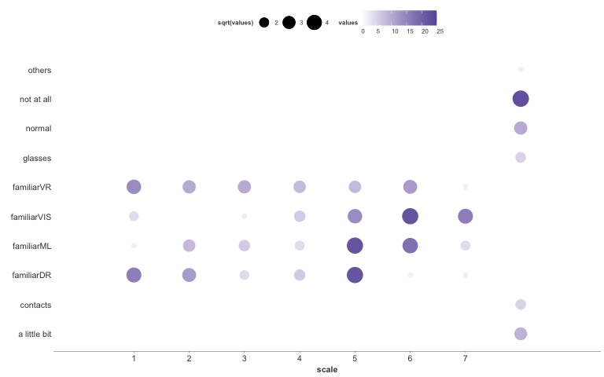

Accuracy range examples
-----------------------

``` r
acc1 <- c(0.3978, 0.4054, 0.5998, 0.602, 0.605, 0.6052, 0.6528, 0.653, 0.6614, 0.6762, 0.6956, 0.7044, 0.713, 0.7162, 0.725, 0.73, 0.7326, 0.7362, 0.7398, 0.745, 0.7458, 0.7476, 0.751, 0.7538, 0.7668, 0.767, 0.7686, 0.7686, 0.769, 0.7744, 0.7748, 0.7754, 0.7758, 0.7778, 0.7788, 0.7794, 0.7806, 0.7828, 0.7834, 0.7848, 0.7858, 0.7882, 0.7888, 0.789, 0.7894, 0.7914, 0.7932, 0.7946, 0.7948, 0.7952, 0.7954, 0.7966, 0.7968, 0.7976, 0.799, 0.7992, 0.801, 0.8014, 0.8018, 0.8026, 0.8028, 0.8032, 0.804, 0.804, 0.8046, 0.805, 0.8056, 0.8058, 0.806, 0.8066, 0.8068, 0.8072, 0.8076, 0.808, 0.8084, 0.8098, 0.8108, 0.8108, 0.8108, 0.8118, 0.812, 0.8132, 0.8138, 0.8138, 0.8148, 0.816, 0.816, 0.8172, 0.8176, 0.8182, 0.8192, 0.8202, 0.8204, 0.8204, 0.8206, 0.8206, 0.8206, 0.8212, 0.8212, 0.822, 0.8224, 0.824, 0.8244, 0.8254, 0.8258, 0.8268, 0.8274, 0.8276, 0.8286, 0.8286, 0.829, 0.8302, 0.8314, 0.8314, 0.8326, 0.833, 0.8332, 0.8338, 0.834, 0.8352, 0.8358, 0.8364, 0.837, 0.8384, 0.8386, 0.8386, 0.8396, 0.8406, 0.8408, 0.8408, 0.8414, 0.842, 0.8428, 0.8436, 0.8442, 0.8444, 0.8444, 0.8446, 0.845, 0.8452, 0.847, 0.8472, 0.8472, 0.8474, 0.8474, 0.848, 0.85, 0.8504, 0.8506, 0.8514, 0.8516, 0.8518, 0.8534, 0.855, 0.8578, 0.858, 0.8582, 0.8584, 0.8584, 0.861, 0.8634, 0.8662, 0.8912, 0.8914, 0.8922, 0.8942, 0.8954, 0.896, 0.896, 0.896, 0.8962, 0.8964, 0.8966, 0.8968, 0.8972, 0.8974, 0.8978, 0.8978, 0.8978, 0.8982, 0.8982, 0.8984, 0.8984, 0.8986, 0.899, 0.8992, 0.8992, 0.8994, 0.8996, 0.8998, 0.8998, 0.8998, 0.8998, 0.8998, 0.9, 0.9, 0.9002, 0.9002, 0.9002, 0.9002, 0.9002, 0.9004, 0.9006, 0.9006, 0.9008, 0.901, 0.901, 0.9012, 0.9012, 0.9014, 0.9014, 0.9014, 0.9016, 0.9018, 0.9018, 0.9018, 0.902, 0.902, 0.902, 0.9022, 0.9024, 0.9026, 0.9026, 0.9026, 0.9026, 0.9026, 0.9028, 0.9028, 0.903, 0.903, 0.903, 0.903, 0.903, 0.9032, 0.9032, 0.9036, 0.9036, 0.9036, 0.9036, 0.9036, 0.9038, 0.9038, 0.9038, 0.9038, 0.9044, 0.9044, 0.9044, 0.9044, 0.9046, 0.9046, 0.905, 0.9052, 0.9052, 0.9052, 0.9054, 0.9054, 0.9056, 0.9056, 0.9056, 0.9058, 0.9058, 0.9058, 0.9058, 0.906, 0.906, 0.906, 0.906, 0.906, 0.9062, 0.9064, 0.9064, 0.9066, 0.9066, 0.9068, 0.9068, 0.9068, 0.9068, 0.907, 0.907, 0.9074, 0.9074, 0.9074, 0.908, 0.908, 0.9086, 0.9092, 0.9092, 0.9092, 0.9092, 0.9094, 0.9094, 0.9098, 0.9098, 0.91, 0.9106, 0.9114, 0.9114, 0.9126, 0.913, 0.9146)


acc2 <- c(0.192, 0.246, 0.394, 0.405, 0.427, 0.439, 0.476, 0.485, 0.488, 0.488, 0.49, 0.491, 0.491, 0.492, 0.492, 0.494, 0.496, 0.496, 0.497, 0.497, 0.497, 0.498, 0.498, 0.499, 0.499, 0.499, 0.5, 0.5, 0.5, 0.5, 0.5, 0.501, 0.504, 0.505, 0.505, 0.506, 0.506, 0.507, 0.507, 0.508, 0.508, 0.508, 0.508, 0.509, 0.509, 0.51, 0.51, 0.511, 0.511, 0.512, 0.512, 0.514, 0.515, 0.515, 0.515, 0.516, 0.522, 0.526, 0.53, 0.531, 0.531, 0.531, 0.534, 0.542, 0.548, 0.559, 0.564, 0.6, 0.625, 0.658, 0.681, 0.697, 0.722, 0.724, 0.726, 0.731, 0.735, 0.739, 0.739, 0.739, 0.739, 0.743, 0.747, 0.748, 0.753, 0.762, 0.764, 0.767, 0.776, 0.79, 0.79, 0.792, 0.795, 0.802, 0.803, 0.81, 0.813, 0.813, 0.817, 0.819, 0.82, 0.82, 0.823, 0.824, 0.824, 0.826, 0.828, 0.828, 0.834, 0.837, 0.838, 0.839, 0.841, 0.841, 0.842, 0.842, 0.843, 0.843, 0.844, 0.847, 0.848, 0.852, 0.853, 0.854, 0.854, 0.854, 0.856, 0.857, 0.857, 0.857, 0.859, 0.86, 0.862, 0.863, 0.863, 0.864, 0.865, 0.866, 0.871, 0.871, 0.874, 0.874, 0.875, 0.876, 0.879, 0.88, 0.881, 0.883, 0.883, 0.883, 0.884, 0.886, 0.886, 0.886, 0.887, 0.887, 0.888, 0.891, 0.891, 0.893, 0.893, 0.894, 0.896, 0.896, 0.896, 0.897, 0.898, 0.899, 0.901, 0.901, 0.901, 0.901, 0.902, 0.903, 0.904, 0.904, 0.904, 0.905, 0.905, 0.905, 0.907, 0.908, 0.908, 0.909, 0.91, 0.91, 0.91, 0.911, 0.911, 0.911, 0.911, 0.912, 0.912, 0.913, 0.913, 0.914, 0.917, 0.917, 0.92, 0.922)

acc3 <- c(0.838, 0.839, 0.8405, 0.8505, 0.8575, 0.8575, 0.865, 0.872, 0.872, 0.873, 0.8735, 0.8745, 0.882, 0.882, 0.8835, 0.885, 0.8865, 0.887, 0.887, 0.892, 0.892, 0.8935, 0.895, 0.8955, 0.896, 0.897, 0.8975, 0.898, 0.898, 0.8985, 0.8985, 0.899, 0.8995, 0.8995, 0.8995, 0.9, 0.9015, 0.902, 0.9025, 0.9035, 0.904, 0.9045, 0.9045, 0.905, 0.9055, 0.9055, 0.906, 0.906, 0.9075, 0.908, 0.9085, 0.9085, 0.9085, 0.9085, 0.9095, 0.9095, 0.9105, 0.9105, 0.9105, 0.911, 0.9115, 0.9115, 0.9115, 0.9115, 0.9125, 0.9125, 0.9125, 0.9125, 0.9125, 0.9125, 0.913, 0.9135, 0.9135, 0.9135, 0.914, 0.914, 0.914, 0.9145, 0.915, 0.915, 0.915, 0.9155, 0.9155, 0.9155, 0.9155, 0.916, 0.916, 0.916, 0.9165, 0.9165, 0.917, 0.917, 0.917, 0.917, 0.9175, 0.918, 0.918, 0.918, 0.918, 0.918, 0.918, 0.918, 0.9185, 0.9185, 0.9185, 0.9185, 0.9185, 0.919, 0.919, 0.919, 0.9195, 0.9195, 0.9195, 0.9195, 0.9195, 0.9195, 0.9195, 0.9195, 0.9195, 0.9195, 0.92, 0.92, 0.92, 0.92, 0.9205, 0.9205, 0.9205, 0.9205, 0.921, 0.921, 0.9215, 0.9215, 0.9215, 0.9215, 0.9215, 0.922, 0.922, 0.922, 0.922, 0.922, 0.922, 0.9225, 0.9225, 0.9225, 0.9225, 0.923, 0.923, 0.923, 0.923, 0.9235, 0.9235, 0.9235, 0.9235, 0.9235, 0.9235, 0.924, 0.924, 0.924, 0.924, 0.9245, 0.9245, 0.9245, 0.9245, 0.9245, 0.9245, 0.9245, 0.9245, 0.925, 0.925, 0.925, 0.925, 0.9255, 0.9255, 0.9255, 0.9255, 0.9255, 0.9255, 0.9255, 0.9255, 0.926, 0.926, 0.926, 0.926, 0.926, 0.9265, 0.9265, 0.927, 0.927, 0.927, 0.927, 0.927, 0.927, 0.927, 0.927, 0.927, 0.9275, 0.9275, 0.9275, 0.9275, 0.928, 0.928, 0.928, 0.928, 0.928, 0.928, 0.928, 0.928, 0.9285, 0.9285, 0.9285, 0.9285, 0.9285, 0.9285, 0.929, 0.929, 0.929, 0.929, 0.929, 0.929, 0.9295, 0.9295, 0.93, 0.93, 0.93, 0.93, 0.93, 0.9305, 0.9305, 0.9305, 0.931, 0.9315, 0.9315, 0.9315, 0.9315, 0.932, 0.9325, 0.9325, 0.933, 0.9335, 0.9335, 0.9335, 0.934, 0.9345, 0.9345, 0.936, 0.936, 0.937, 0.937, 0.94, 0.9405)

bars_color <- "#6959a6"

g_bar1 <- ggplot() +
           theme(panel.grid.major.x = element_blank()) +
           geom_linerange(aes(ymax = 1, ymin = 0, x = acc1), size = 0.07, color = bars_color) +
           scale_x_continuous(limits=c(0,1), breaks = seq(0, 1, by = 0.1), expand=c(0,0)) +
           scale_y_continuous(limits=c(0,1), breaks = seq(0, 1, by = 1), expand=c(0,0)) +
           ggtitle("CIFAR-10")

g_bar2 <- ggplot() +
            theme(panel.grid.major.x = element_blank()) +
            geom_linerange(aes(ymax = 1, ymin = 0, x = acc2), size = 0.07, color = bars_color) +
            scale_x_continuous(limits=c(0,1), breaks = seq(0, 1, by = 0.1), expand=c(0,0)) +
            scale_y_continuous(limits=c(0,1), breaks = seq(0, 1, by = 1), expand=c(0,0))+
            ggtitle("bABI")

g_bar3 <- ggplot() +
            theme(panel.grid.major.x = element_blank()) +
            geom_linerange(aes(ymax = 1, ymin = 0, x = acc3), size = 0.07, color = bars_color) +
            scale_x_continuous(limits=c(0,1), breaks = seq(0, 1, by = 0.1), expand=c(0,0)) +
            scale_y_continuous(limits=c(0,1), breaks = seq(0, 1, by = 1), expand=c(0,0)) +
            ggtitle("F-MNIST")

g_bars <- ggarrange(g_bar1, g_bar2, g_bar3, ncol = 1, align="v")

ggsave(file = "pic/acc_bar.pdf", g_bars , width = 4, height = 2, units = "in")

g_bars
```

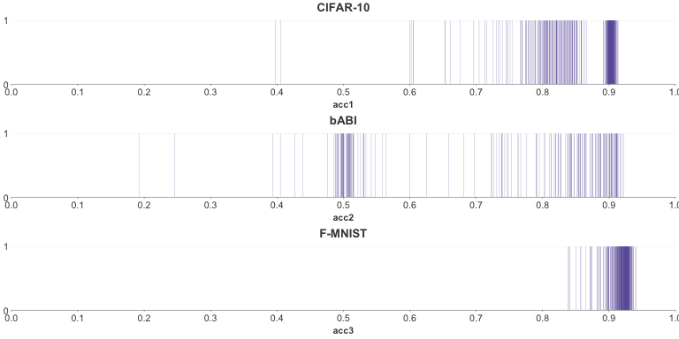
